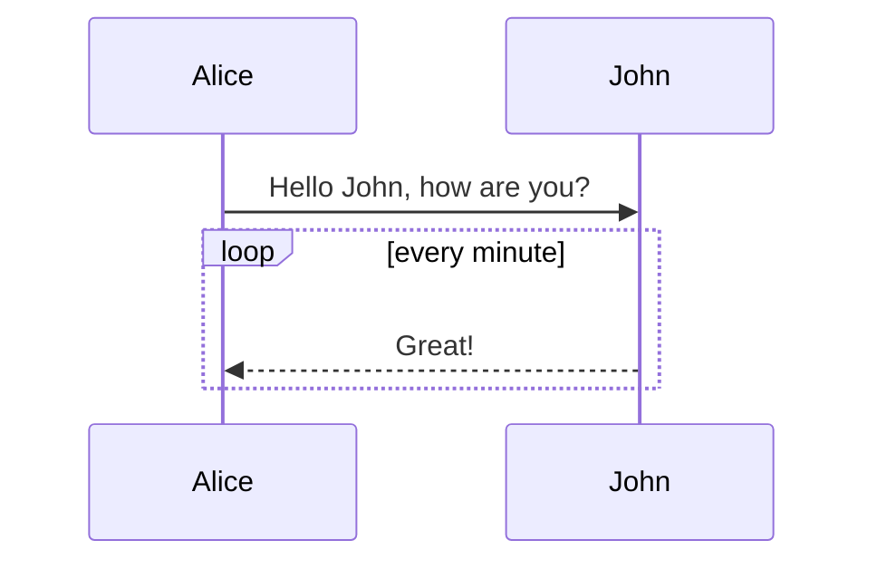

# Markdown 进阶

## 内容目录

在段落中填写 `[TOC]` 以显示全文内容的目录结构。

[[TOC]]

## 标签分类

在编辑区任意行的列首位置输入以下代码给文稿标签：

```markdown
标签： 数学 英语 Markdown
```

或者

```markdown
Tags: 数学 英语 Markdown
```

## 删除线

使用 ~~ 表示删除线。

例如：

```Markdown
~~这是一段错误的文本。~~
```

~~这是一段错误的文本。~~

## 注脚

使用 [^注脚名] 表示注脚。


```markdown
这是一个注脚[^footnote]的样例。

[^footnote]: I love FDUCSLG!
```

## LaTeX 公式

`$` 表示行内公式： 

```markdown
$E = mc^2$
```

$E=mc^2$ 

`$$` 表示整行公式：

```markdown
$$
\sum_{i=1}^n a_i=0
$$

$$
f(x_1,x_x,\ldots,x_n) = x_1^2 + x_2^2 + \cdots + x_n^2 
\\
\sum^{j-1}_{k=0}{\widehat{\gamma}_{kj} z_k}
$$
```

$$
\sum_{i=1}^n a_i=0
$$

$$
f(x_1,x_x,\ldots,x_n) = x_1^2 + x_2^2 + \cdots + x_n^2 
\\
\sum^{j-1}_{k=0}{\widehat{\gamma}_{kj} z_k}
$$

学习 [Latex](./latex) 获得更多使用方法。

## 加强的代码块

支持四十一种编程语言的语法高亮的显示，行号显示。

Python：

```python
import time

def countdown(time_sec):
    while time_sec:
        mins, secs = divmod(time_sec, 60)
        timeformat = '{:02d}:{:02d}'.format(mins, secs)
        print(timeformat, end='\r')
        time.sleep(1)
        time_sec -= 1

    print("stop")

countdown(5)
```

JavaScript：

```javascript
/**
* nth element in the fibonacci series.
* @param n >= 0
* @return the nth element, >= 0.
*/
function fib(n) {
  var a = 1, b = 1;
  var tmp;
  while (--n >= 0) {
    tmp = a;
    a += b;
    b = tmp;
  }
  return a;
}

document.write(fib(10));
```

## Mermaid 序列图



### 更多语法参考：[Mermaid 序列图语法参考](https://knsv.github.io/mermaid/#sequence-diagrams)

## 表格

```markdown
| 项目   |  价格 | 数量 |
| ------| ----- | --- |
| 计算机 | 1600$ |  5  |
| 手机   |  200$ |  12 |
| 管线   |    1$ | 234 |
```

| 项目   |  价格 | 数量 |
| ------ | ---- | -- |
| 计算机 | 1600$ |  5   |
| 手机   |  200$ |  12  |
| 管线   |    1$ | 234  |

## HTML 标签

部分平台支持在 Markdown 语法中嵌套 HTML 标签，譬如，你可以用 HTML 写一个纵跨两行的表格：

```markdown
<table>
    <thead>
        <tr>
            <th rowspan="2">值班人员</th>
            <th>星期一</th>
            <th>星期二</th>
            <th>星期三</th>
        </tr>
    </thead>
    <tbody>
        <tr>
            <td>李强</td>
            <td>张明</td>
            <td>王平</td>
        </tr>
    </tbody>
</table>
```

<table>
    <thead>
        <tr>
            <th rowspan="2">值班人员</th>
            <th>星期一</th>
            <th>星期二</th>
            <th>星期三</th>
        </tr>
    </thead>
    <tbody>
        <tr>
            <td>李强</td>
            <td>张明</td>
            <td>王平</td>
        </tr>
    </tbody>
</table>

## 内嵌图标

### 使用 Emoji

Markdown 支持 Emoji，例如：

```markdown
🚀 这个是一个火箭图标
```

🚀 这个是一个火箭图标

### 使用 Unicode 字符

可以使用 HTML 的 `&#x` 方式插入 Unicode 图标：

```markdown
&#x1F681; 这个是一个直升机图标
```

&#x1F681; 这个是一个直升机图标

### 使用 SVG 图标

你可以直接插入 SVG 代码：

```markdown
<svg width="16" height="16" viewBox="0 0 16 16" fill="currentColor" xmlns="http://www.w3.org/2000/svg">
  <path d="M8 0L6.6 5H1.5L5.4 8.1L3.8 13L8 10.2L12.2 13L10.6 8.1L14.5 5H9.4L8 0Z"/>
</svg>
```

<svg width="16" height="16" viewBox="0 0 16 16" fill="currentColor" xmlns="http://www.w3.org/2000/svg">
  <path d="M8 0L6.6 5H1.5L5.4 8.1L3.8 13L8 10.2L12.2 13L10.6 8.1L14.5 5H9.4L8 0Z"/>
</svg>

这需要 Markdown 解析器支持 HTML（如 VitePress）。

## Todo 列表

使用带有 [ ] 或 [x]（未完成 或 已完成）项的列表语法撰写一个待办事宜列表，并且支持子列表嵌套以及混用Markdown语法，例如：

```markdown
- [ ] **Cmd Markdown 开发**
    - [ ] 改进 Cmd 渲染算法，使用局部渲染技术提高渲染效率
    - [ ] 支持以 PDF 格式导出文稿
    - [x] 新增Todo列表功能 [语法参考](https://github.com/blog/1375-task-lists-in-gfm-issues-pulls-comments)
    - [x] 改进 LaTex 功能
        - [x] 修复 LaTex 公式渲染问题
        - [x] 新增 LaTex 公式编号功能 [语法参考](http://docs.mathjax.org/en/latest/tex.html#tex-eq-numbers)
- [ ] **七月旅行准备**
    - [ ] 准备邮轮上需要携带的物品
    - [ ] 浏览日本免税店的物品
    - [x] 购买蓝宝石公主号七月一日的船票
```

- [ ] **Cmd Markdown 开发**
  - [ ] 改进 Cmd 渲染算法，使用局部渲染技术提高渲染效率
  - [ ] 支持以 PDF 格式导出文稿
  - [x] 新增Todo列表功能 [语法参考](https://github.com/blog/1375-task-lists-in-gfm-issues-pulls-comments)
  - [x] 改进 LaTex 功能
    - [x] 修复 LaTex 公式渲染问题
    - [x] 新增 LaTex 公式编号功能 [语法参考](http://docs.mathjax.org/en/latest/tex.html#tex-eq-numbers)

- [ ] **七月旅行准备**

  - [ ] 准备邮轮上需要携带的物品

  - [ ] 浏览日本免税店的物品

  - [x] 购买蓝宝石公主号七月一日的船票
