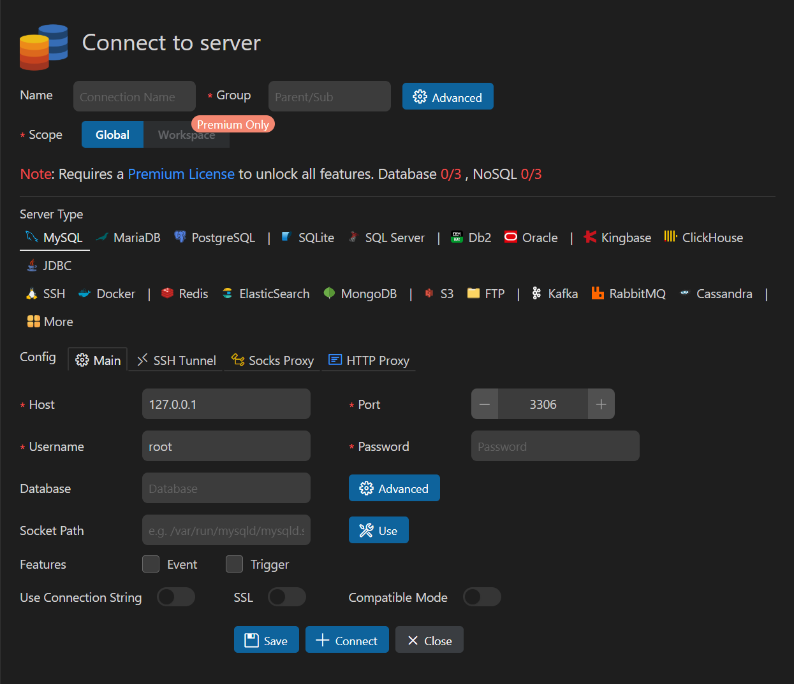
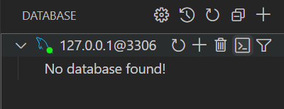

# VSCode
> Visual Studio Code（简称 VS Code）是由微软开发的一款免费、开源、轻量级的代码编辑器。它支持多种编程语言，并具有强大的扩展功能，适用于前端开发、后端开发、数据科学、DevOps 等多个领域。考虑到大部分同学使用 Python 进行编程，并且期末项目可能涉及前端开发，我们推荐大家使用 VSCode 来进行期末项目的开发。

## 安装 VSCode
- 可以参考这份 [VSCode 详细安装教程](https://zhuanlan.zhihu.com/p/264785441)

## 安装插件
> 安装完 VSCode 后，它本身相当于一个功能简化的“记事本”。真正让它具备强大功能的是各种扩展插件。以下是为支持 Python 编程、前端开发、数据库操作等场景推荐的一些实用插件。

### 功能类插件
- **语言包**
  - Chinese (Simplified) Language Pack for Visual Studio Code（简体中文语言包）
- **错误提示增强**
  - Error Gutters  
  - Error Lens
- **Markdown 支持**
  - Markdown All in One  
  - Markdown Preview Enhanced  
  :::tip
  在标准项目中，我们通常会提供一个 `README.md` 文件（相信大家在 GitHub 上的项目仓库中也见过）。这个文件是你向他人介绍项目内容的重要窗口，它应当包括项目结构、依赖环境、运行方法等关键信息。建议同学们学习 Markdown 的基本语法（如标题、加粗、列表、代码块等）
  :::
- **路径提示与自动补全**
  - Path Intellisense    
  :::warning    
  开发过程中请熟悉“绝对路径”与“相对路径”的区别。一般来说，为保证项目的可移植性，我们推荐使用相对路径。同时，**请务必以“文件夹”形式打开整个项目**，而不是直接用 VSCode 打开单个文件。
  :::
- **代码格式与数据文件支持**
  - Prettier - Code formatter（统一代码格式）  
  - Prettify JSON（JSON 美化）  
  - Rainbow CSV（CSV 文件高亮）
- **PDF 文件阅读**
  - vscode-pdf

### Python 开发相关插件
- Python Extension Pack（Python 官方推荐插件合集）
- MagicPython（增强语法高亮）
- Black Formatter（代码风格统一工具）
- Pylance（类型检查与智能补全）
- Django（提供模板语法高亮、自动补全、模型字段提示等功能）

### Git 使用相关插件
- GitLens（强大的 Git 历史和代码变更可视化工具）  
- Git History（查看提交历史）  
- gitignore（可自动拉取常见 `.gitignore` 模板，下一节将详细介绍其作用）

### MySQL 数据库支持
- **MySQL 插件**  
  - 安装插件后，在左侧导航栏点击 **Database**，选择 **Create Connection** 创建连接  
  - 在弹出的连接配置窗口中填写数据库连接信息，特别是密码字段，然后点击 **Connect**  
    
  - 连接成功后，重新点击左侧导航栏的 **Database**，将看到如下界面：  
    

      
    

  - 在此界面中，你可以创建数据表、编写 SQL 语句（插件提供代码高亮与自动补全）、或使用终端交互模式。创建完数据表后，还可以查看表结构、字段类型、是否非空等元信息，鼓励大家多多尝试和探索。
  - 在期末项目开发中，也可以直接通过该插件可视化数据库中各表的数据，极大方便调试与排错。

## 快捷键
- 参考 [官方文档](https://code.visualstudio.com/shortcuts/keyboard-shortcuts-windows.pdf)
> ✅ 建议优先掌握：注释、查找、格式化、打开终端、移动/复制/删除行、插入空行、文件快速跳转  
> 💡 鼠标 + 快捷键组合可以大大提升多光标编辑效率  
> 📌 小贴士：如果你发现某个操作没有快捷键，也可以在「快捷键设置」中自定义绑定！
